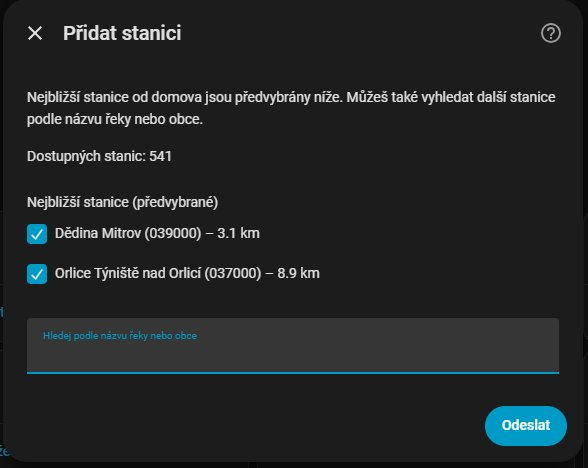
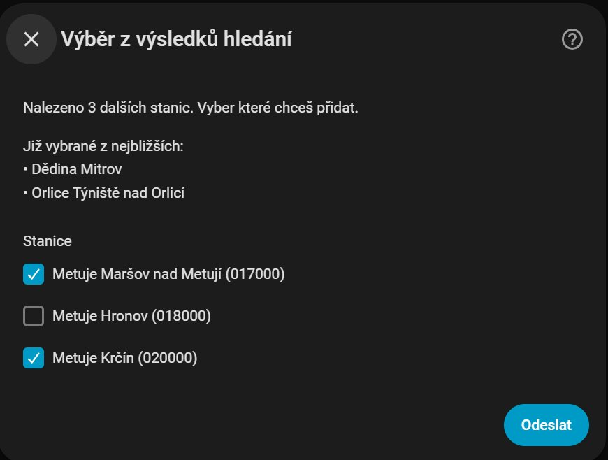
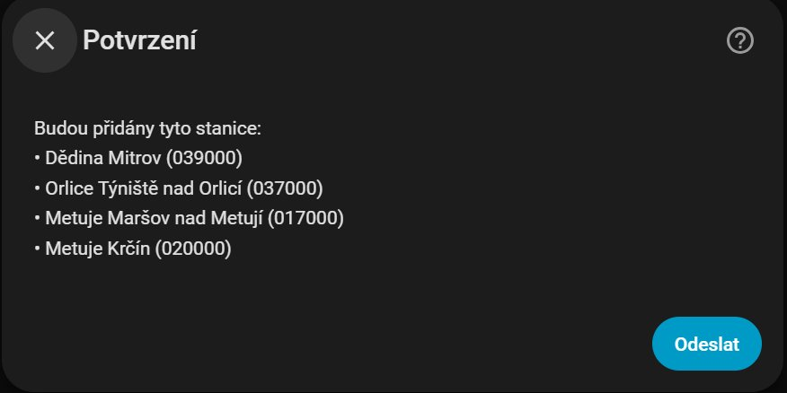
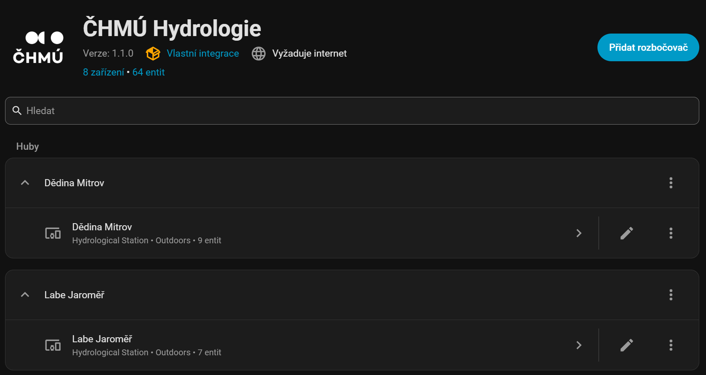
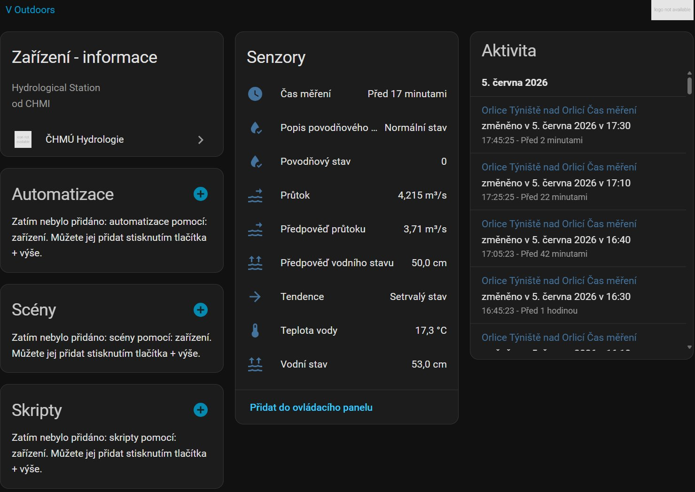
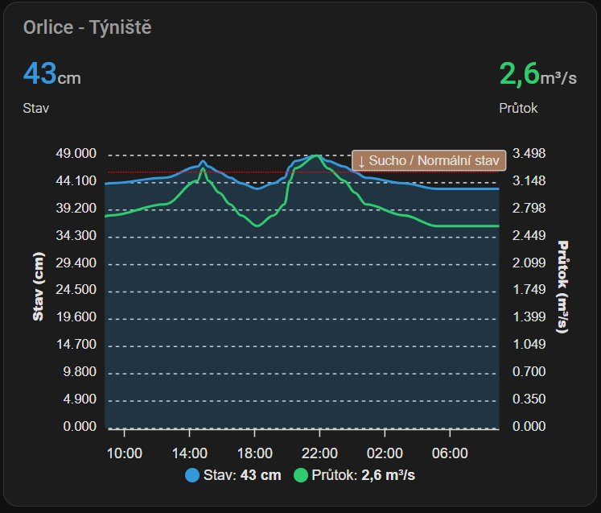
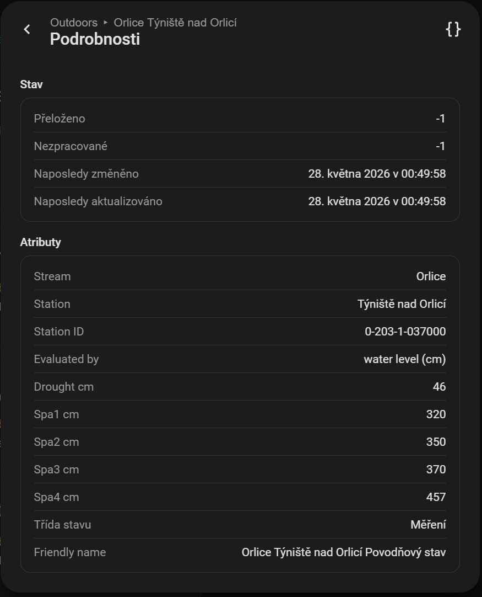
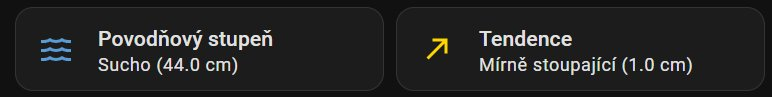
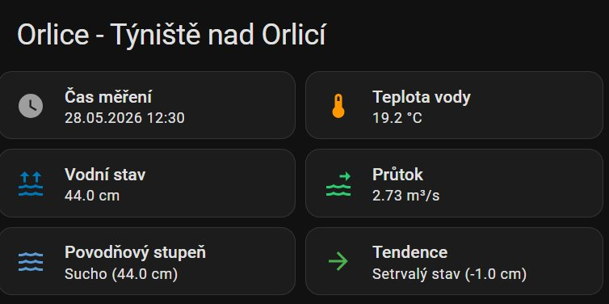
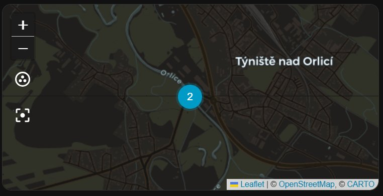

# CHMI Hydrology

🇬🇧 English | 🇨🇿 [Česky](README.cs.md)

[](https://github.com/hacs/integration)


Home Assistant custom integration for monitoring river water levels, flow rates and flood activity using open data from the **Czech Hydrometeorological Institute (CHMI)** — [opendata.chmi.cz](https://opendata.chmi.cz).

> **Regional scope:** Data covers the **Czech Republic**. May also be of interest to users in neighbouring countries (Slovakia, Germany, Austria, Poland) for cross-border river monitoring.

The integration UI is available in multiple languages. Translations for English, Czech and Slovak are included.

---

## Features

- Search stations by river or town name
- Physical sensors: water level, flow rate, water temperature, forecasts
- Logical sensors: flood status (numeric + text), tendency
- Automatic map display — sensors with coordinates appear on the HA map automatically
- Auto-refresh every 10 minutes
- **30-day history bootstrap on first setup** — no empty graphs
- Multi-language UI

---

## Ready from Day One

Unlike most integrations that start with an empty graph, CHMI Hydrology automatically
downloads 30 days of historical data on first setup and imports it directly into each
sensor's own history. It runs in the background right after setup completes, so it never
delays adding a station. Open any water level, flow rate or temperature sensor right after
installation and its history already covers a full month — no extra dashboard card needed,
and it keeps growing from there like any other sensor's history.

This 30-day history comes from CHMI's own [`recent/`
archive](https://opendata.chmi.cz/hydrology/recent/data/) — the same open-data source as the
live readings, just the part of it that holds roughly the last year of 10-minute
measurements (as opposed to the `now/` endpoint the integration otherwise polls every 10
minutes for current data). It's decimated into hourly averages before being imported, since
Home Assistant's Long-Term Statistics are hourly, not 10-minute, resolution.

> **Note:** the small graph shown directly in an entity's "more info" popup only previews a
> short recent window by default. Click **Show more** (below the graph) to open the full
> history page, where the 30-day bootstrap is visible — this is standard Home Assistant
> behavior for every entity, not something specific to this integration. If you'd rather see
> the full range at a glance without the extra click, add a [history graph
> card](#2-long-term-history-30-days) to your dashboard — it renders the same underlying
> history, just always expanded.

> **Note:** In the first days of January, CHMI is still rotating the previous year's data into
> its `historical/` archive, so fewer than 30 days may be available for a short time. This is
> expected and resolves itself automatically as new days accumulate.

---

## Requirements

- Home Assistant 2023.6 or newer
- HACS installed
- Internet access from HA instance

---

## Installation

### Via HACS (recommended)

1. Open HACS → Integrations
2. Search for **CHMI Hydrology**
3. Click **Download**
4. Restart Home Assistant

### Manual

1. Download the latest release ZIP
2. Extract and copy the `chmi_hydrology/` folder to `config/custom_components/`
3. Restart Home Assistant

---

## Configuration

1. Go to **Settings → Integrations → Add Integration**
2. Search for **CHMI Hydrology**
3. If your HA home location is set, nearby stations (within 10 km) are shown pre-selected automatically
4. You can also search for any station by river or town name
5. Select one or more stations and confirm — sensors are created automatically



If you search for a station by name, an additional selection screen appears:



After selecting all stations, confirm your selection:



After setup, the integration shows all configured stations with their entities:



Click on a station to see all its entities:



To add another station use **Add entry** on the integration card. To remove a station open the entry and delete it.

> **Note:** SPA flood thresholds and evaluation type (`SPA_TYP`) are saved from metadata when the station is added. The integration does not re-fetch metadata at runtime — if CHMI changes thresholds, re-add the station.

---

## Data Source

```
https://opendata.chmi.cz/hydrology/now/
```

Station metadata (names, coordinates, flood thresholds):
```
https://opendata.chmi.cz/hydrology/now/metadata/meta1.json
```

Station measurements:
```
https://opendata.chmi.cz/hydrology/now/data/{station_id}.json
```

CHMI typically updates data every **10 minutes**. Field code reference: [Popis_kodu_now_a_recent.pdf](https://opendata.chmi.cz/hydrology/read_me/Popis_kodu_now_a_recent.pdf)

Historical data for the [30-day bootstrap](#ready-from-day-one) (one-time, on first setup only):
```
https://opendata.chmi.cz/hydrology/recent/data/{date}_{station_id}.json
```

---

## Entities

Each configured station creates the following entities. Displayed names adapt to your HA language setting.

> **Finding entity IDs:** Entity IDs depend on the station name and your HA language. Find your actual entity IDs in **Developer Tools → States** by filtering for the river or station name.

### CHMI Code Mapping

| CHMI Code | Translation Key | Description |
|---|---|---|
| `H` | `water_level` | Water level |
| `H_F` | `water_level_fc` | Water level forecast |
| `Q` | `flow_rate` | Flow rate |
| `Q_F` | `flow_rate_fc` | Flow rate forecast |
| `T` / `TH` | `water_temp` | Water temperature |
| *(derived)* | `last_measurement` | Last measurement time |
| *(derived)* | `flood_status` | Flood status (numeric) |
| *(derived)* | `flood_status_desc` | Flood status (text) |
| *(derived)* | `trend` | Tendency |

### Physical Sensors

Created **only if the station provides that measurement**.

| Translation Key | Unit | Description |
|---|---|---|
| `water_level` | cm | Current water level |
| `water_level_fc` | cm | Water level forecast |
| `flow_rate` | m³/s | Current flow rate |
| `flow_rate_fc` | m³/s | Flow rate forecast |
| `water_temp` | °C | Water temperature |

The `water_level` and `flow_rate` sensors include `latitude` and `longitude` attributes — see [Map](#map) section below.

### Derived (Logical) Sensors

Always created regardless of what the station measures.

#### Last Measurement

Timestamp of the most recent reading (`timestamp` device class).

#### Flood Status (numeric)

Range: `-1` to `4`. Evaluated using `SPA_TYP` from station metadata:

| Value | Meaning | Condition |
|---|---|---|
| `-1` | Drought | below `DRYH` / `DRYQ` |
| `0` | Normal | below SPA1 threshold |
| `1` | SPA1 – Watch | ≥ `SPA1H` / `SPA1Q` |
| `2` | SPA2 – Advisory | ≥ `SPA2H` / `SPA2Q` |
| `3` | SPA3 – Warning | ≥ `SPA3H` / `SPA3Q` |
| `4` | SPA4 – Emergency | ≥ `SPA4H` / `SPA4Q` |

Threshold values are exposed as sensor attributes (`spa1_cm`, `drought_cm` or `spa1_m3s` etc.).

#### Flood Status (text)

Returns a translated state string corresponding to the numeric flood status.

#### Tendency

Compares average of last 3 readings (~30 min) with average of previous 3 readings (30–60 min ago).

| Value | Threshold |
|---|---|
| `falling_fast` | diff < −10 |
| `falling` | −10 ≤ diff < −3 |
| `falling_slow` | −3 ≤ diff < −1 |
| `steady` | −1 ≤ diff < +1 |
| `rising_slow` | +1 ≤ diff < +3 |
| `rising` | +3 ≤ diff < +10 |
| `rising_fast` | diff ≥ +10 |

Units: cm (H-type stations) or m³/s (Q-type). Returns `None` if less than ~60 min of history is available.

---

## Map

The `water_level` and `flow_rate` sensors include `latitude` and `longitude` attributes (WGS84). This means they **automatically appear on the HA map** without any additional configuration.

When multiple sensors are at the same location, click on the station marker first to see individual sensor values.

Optionally you can also use a dedicated map card:

```yaml
type: map
entities:
  - entity: sensor.YOUR_WATER_LEVEL_ENTITY
    name: "Station – Water Level"
  - entity: sensor.YOUR_FLOW_RATE_ENTITY
    name: "Station – Flow Rate"
hours_to_show: 0
```

---

## Dashboard Cards

> **Note:** Graph examples use [ApexCharts Card](https://github.com/RomRider/apexcharts-card) and status/tendency cards use [Mushroom Cards](https://github.com/piitaya/lovelace-mushroom). Both must be **installed separately via HACS** before use.

> **Entity IDs:** Replace entity IDs in examples with your actual entity IDs. Find them in **Developer Tools → States** by filtering for your river or station name.

### 1. Water Level + Flow Rate

Combined dual-axis chart — water level (left axis, cm) and flow rate (right axis, m³/s) with SPA threshold annotations.



```yaml
type: custom:apexcharts-card
header:
  show: true
  title: Station Name
  show_states: true
  colorize_states: true
graph_span: 24h
apex_config:
  annotations:
    yaxis:
      - "y": 46
        borderColor: "#ff0000"
        strokeWidth: 1
        label:
          text: ↓ Drought / Normal
          position: right
          style:
            colors: "#fff"
            background: "#a67b5b"
      - "y": 320
        borderColor: "#f1c40f"
        strokeWidth: 1
        label:
          text: ↑ SPA1
          position: right
          style:
            colors: "#fff"
            background: "#4caf50"
      - "y": 350
        borderColor: "#e67e22"
        strokeWidth: 1
        label:
          text: ↑ SPA2
          position: right
          style:
            colors: "#fff"
            background: "#ffd600"
      - "y": 370
        borderColor: "#c0392b"
        strokeWidth: 1
        label:
          text: ↑ SPA3
          position: right
          style:
            colors: "#fff"
            background: "#f44336"
      - "y": 457
        borderColor: "#7b241c"
        strokeWidth: 1
        label:
          text: ↑ SPA4
          position: right
          style:
            colors: "#fff"
            background: "#b71c1c"
  yaxis:
    - id: stav
      min: 0
      decimalsInFloat: 0
    - id: prutok
      opposite: true
      min: 0
series:
  - entity: sensor.YOUR_WATER_LEVEL_ENTITY
    name: Water Level
    unit: cm
    stroke_width: 2
    type: area
    opacity: 0.2
    color: "#3498db"
    yaxis_id: stav
  - entity: sensor.YOUR_FLOW_RATE_ENTITY
    name: Flow Rate
    unit: m³/s
    type: line
    stroke_width: 2
    color: "#2ecc71"
    yaxis_id: prutok
```

> Replace SPA threshold values (`46`, `320`, `350`, `370`, `457`) with your station's actual values. Find them in the `flood_status` sensor attributes under **Settings → Devices → entity → Details**:



---

### 2. Long-Term History (30 Days)

Thanks to the [30-day history bootstrap](#ready-from-day-one), each sensor's own history
already covers a full month right after setup — the entity's built-in "more info" popup shows
it as soon as you click **Show more** (see note above). If you'd rather have it visible
directly on a dashboard, without that extra click, use HA's native `history-graph` card — it
renders the exact same combined history as the popup, just always expanded:

```yaml
type: history-graph
title: Water Level – 30 Day History
entities:
  - sensor.YOUR_WATER_LEVEL_ENTITY
hours_to_show: 720
```

Alternatively, the `statistics-graph` card shows the same data aggregated into hourly
mean/min/max bars instead of a continuous line — useful if you prefer that style:

```yaml
type: statistics-graph
title: Water Level – History
entities:
  - sensor.YOUR_WATER_LEVEL_ENTITY
stat_types:
  - mean
period: hour
days_to_show: 30
```

> For the same chart in ApexCharts Card, use a `statistics` series instead of `entity`:
> ```yaml
> series:
>   - entity: sensor.YOUR_WATER_LEVEL_ENTITY
>     statistics:
>       type: mean
>       period: hour
> ```

---

### 3. Flood Status + Tendency

Two [Mushroom Cards](https://github.com/piitaya/lovelace-mushroom) displayed side by side.



**Flood Status card** — icon color follows the official CHMI color coding: light blue = normal, green = SPA1, yellow = SPA2, red = SPA3, dark red = SPA4.

```yaml
type: custom:mushroom-template-card
primary: Flood Status
secondary: >-
  {{ state_translated('sensor.YOUR_FLOOD_STATUS_DESC_ENTITY') }}
  ({{ states('sensor.YOUR_WATER_LEVEL_ENTITY') }} cm)
icon: mdi:waves
icon_color: >-
  
  #5b9bd5
  #90caf9
  #4caf50
  #ffd600
  #f44336
  #b71c1c
  #9e9e9e
fill_container: true
```

**Tendency card** — icon and color change dynamically based on current tendency.

```yaml
type: custom:mushroom-template-card
primary: Tendency
secondary: >-
  {{ state_translated('sensor.YOUR_TREND_ENTITY') }}
  ({{ state_attr('sensor.YOUR_TREND_ENTITY', 'difference') }} cm)
icon: >-
  
  mdi:arrow-down-bold
  mdi:arrow-down
  mdi:arrow-bottom-right
  mdi:arrow-right
  mdi:arrow-top-right
  mdi:arrow-up
  mdi:arrow-up-bold
  mdi:minus
icon_color: >-
  
  #b71c1c
  #f44336
  #90caf9
  #4caf50
  #ffd600
  #ff9800
  #b71c1c
  #9e9e9e
fill_container: true
```

---

### 4. Station Overview

A vertical stack of Mushroom cards providing a complete station summary.



> **Note:** If your station does not provide water temperature, remove the temperature card from the horizontal stack.

```yaml
title: Station Name
type: vertical-stack
cards:
  - type: horizontal-stack
    cards:
      - type: custom:mushroom-template-card
        primary: Last Measurement
        secondary: >-
          {{ states('sensor.YOUR_LAST_MEASUREMENT_ENTITY') | as_timestamp
          | timestamp_custom('%d.%m.%Y %H:%M') }}
        icon: mdi:clock
        icon_color: "#9e9e9e"
        fill_container: true
      - type: custom:mushroom-template-card
        primary: Water Temperature
        secondary: "{{ states('sensor.YOUR_WATER_TEMP_ENTITY') }} °C"
        icon: mdi:thermometer
        icon_color: "#ff9800"
        fill_container: true
  - type: horizontal-stack
    cards:
      - type: custom:mushroom-template-card
        primary: Water Level
        secondary: "{{ states('sensor.YOUR_WATER_LEVEL_ENTITY') }} cm"
        icon: mdi:waves-arrow-up
        icon_color: "#0077b6"
        fill_container: true
      - type: custom:mushroom-template-card
        primary: Flow Rate
        secondary: "{{ states('sensor.YOUR_FLOW_RATE_ENTITY') }} m³/s"
        icon: mdi:waves-arrow-right
        icon_color: "#2ecc71"
        fill_container: true
  - type: horizontal-stack
    cards:
      - type: custom:mushroom-template-card
        primary: Flood Status
        secondary: >-
          {{ state_translated('sensor.YOUR_FLOOD_STATUS_DESC_ENTITY') }}
          ({{ states('sensor.YOUR_WATER_LEVEL_ENTITY') }} cm)
        icon: mdi:waves
        icon_color: >-
          
          #5b9bd5
          #90caf9
          #4caf50
          #ffd600
          #f44336
          #b71c1c
          #9e9e9e
        fill_container: true
      - type: custom:mushroom-template-card
        primary: Tendency
        secondary: >-
          {{ state_translated('sensor.YOUR_TREND_ENTITY') }}
          ({{ state_attr('sensor.YOUR_TREND_ENTITY', 'difference') }} cm)
        icon: >-
          
          mdi:arrow-down-bold
          mdi:arrow-down
          mdi:arrow-bottom-right
          mdi:arrow-right
          mdi:arrow-top-right
          mdi:arrow-up
          mdi:arrow-up-bold
          mdi:minus
        icon_color: >-
          
          #b71c1c
          #f44336
          #90caf9
          #4caf50
          #ffd600
          #ff9800
          #b71c1c
          #9e9e9e
        fill_container: true
```

---

### 5. Map

The `water_level` and `flow_rate` sensors automatically appear on the HA map. For a dedicated map card:



```yaml
type: map
entities:
  - entity: sensor.YOUR_WATER_LEVEL_ENTITY
    name: Station – Water Level
  - entity: sensor.YOUR_FLOW_RATE_ENTITY
    name: Station – Flow Rate
hours_to_show: 0
theme_mode: auto
```

---

## Flood Warning Automation

The following automation sends a notification when SPA1 (Watch) is reached. The `numeric_state` trigger fires **only once** when the value crosses the threshold — not repeatedly while it stays above it.

> Similarly you can set up warnings for SPA2 (`above: 1`), SPA3 (`above: 2`) and SPA4 (`above: 3`).

> Replace `notify.notify` with your specific notification service e.g. `notify.mobile_app_your_phone`.

```yaml
alias: "Warning – Station SPA1"
triggers:
  - entity_id: sensor.YOUR_FLOOD_STATUS_ENTITY
    above: 0
    trigger: numeric_state
actions:
  - data:
      title: "⚠️ Warning – Station SPA1 (Watch)"
      message: >
        SPA1 flood activity level reached (Watch)!
        Water level: {{ states('sensor.YOUR_WATER_LEVEL_ENTITY') }} cm
        Flow rate: {{ states('sensor.YOUR_FLOW_RATE_ENTITY') }} m³/s
        Tendency: {{ state_translated('sensor.YOUR_TREND_ENTITY') }}
    action: notify.notify
```

---

## License

MIT License. Data provided by [CHMI](https://www.chmi.cz) under open data license.

Data is licensed under [Creative Commons Attribution 4.0 (CC BY 4.0)](https://creativecommons.org/licenses/by/4.0/deed.en). The CHMI logo is used with permission from CHMI for the purpose of identifying the data source.

> **This project is not developed, operated, or endorsed by CHMI.** It is an independent open-source project created by the Home Assistant community.

For a detailed description of the integration structure, data flow and sensor logic see [Architecture.md](Architecture.md).
